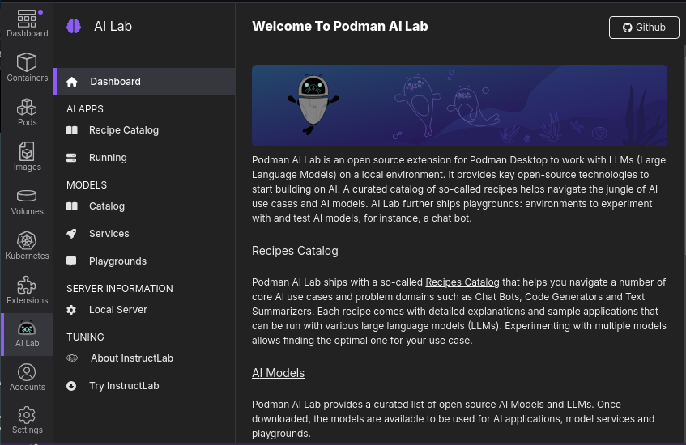

# Podman AI Lab
### Fast, Local AI with Containers

---

---
# What is Podman AI Lab?

# 🛠️ Key Features

- ✅ One-click download & run of AI models
- 🧪 Includes curated open-source LLMs (e.g., Mistral 7B)
- 🖥️ Local web UI for chatting with models
- 🔐 Fully offline — no API keys or telemetry
- 📦 Containerized with Podman for easy setup and isolation

---

# 🔧 Developer-Friendly Setup

- Built on OCI-compliant containers
- Run from **Podman Desktop** GUI or CLI
- Automatically pulls model containers
- Minimal host system requirements
- Fast to reset or clean with `podman system reset`

<!--
- An **extension for Podman Desktop**
- Lets you **run AI models locally** in containers
- Based on **open-source models** (Mistral, LLaMA, etc.)
- catalog of recipes, curated list of open source models
- exposes LLMs through inference APIs that you can directly access from your application containers.
- use playgrounds to optimize inference parameters and recipes that help with pre-baked examples.

-->

---

# 🌟 Why It Matters

- 💻 Explore AI locally
- 🧰 Test AI workflows without GPU dependency
- 🧠 Understand model behavior in a controlled way
- 🛡️ Improves privacy for prototyping and demos

