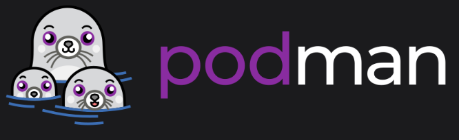
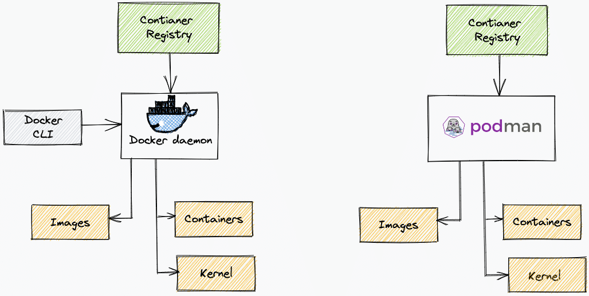

# Getting Started with Podman
### A Developer-Friendly Container Engine

---

# What is Podman?

- Open-source container management tooling
- Has a GUI, CLI-compatible with Docker
- Built for Linux-first, but cross-platform via VM
- Developed and maintained by Red Hat

<!--
**🧠 Speaker Notes:**  
container management: build, deploy, manage containers and images
-->
---

# Why Use Podman?

- ✅ No root required (uses your user's privileges)
- ✅ No background daemon
- ✅ Docker-compatible CLI
- ✅ systemd integration via 'quadlets' 

<!--
**🧠 Speaker Notes:**  
runs containers w/ your privs (better security, reduced attack surface
docker compatible cli: easy transition
quadles replaces 'podman generate systemd'
-->
---

## Podman: daemonless architecture

---

# Podman vs Docker

| Feature         | Podman                  | Docker            |
|----------------|-------------------------|-------------------|
| Daemonless     | ✅ Yes                   | ❌ No              |
| Rootless       | ✅ Yes                   | ⚠️ Limited         |
| Docker CLI     | ✅ Compatible            | ✅ Native          |
| Compose Support| ✅ (via podman-compose)  | ✅ Yes             |
| Systemd Support| ✅ Native                | ⚠️ Limited         |

<!--
**🧠 Speaker Notes:**  
For most day-to-day tasks, Podman works just like Docker. But behind the scenes, the architecture is different—and often safer by default.
-->
---

# Unique Features

- 🔒 **Rootless containers**
- 🪄 **Pods** (Kubernetes-style group of containers)
- ⚙️ **Systemd integration**
- 🧪 **Machine mode for non-Linux hosts**
- 🔁 **Auto-restart containers** via systemd

<!--
**🧠 Speaker Notes:**  
Podman introduces pods as a first-class concept, aligning with Kubernetes. It also integrates tightly with systemd so you can manage containers like services.
-->
---

# Podman + Kubernetes

- `podman generate kube`  
  → Export container setup as Kubernetes YAML

- `podman play kube`  
  → Run Kubernetes YAML locally using Podman

- Great for:
  - Local testing before deploying to a real cluster
  - Teaching Kubernetes concepts

<!--
**🧠 Speaker Notes:**  
Podman is a useful learning and dev tool for Kubernetes users. You can take a local container and turn it into K8s manifests with a single command. The reverse is true too.
-->
---

# Developer Use Cases

- 🧪 Try containers without Docker installed
- 🔐 Test rootless setups for security-sensitive apps
- 📦 Build container images with OCI compatibility
- 🚀 Prepare for Kubernetes deployments locally

<!--
**🧠 Speaker Notes:**  
If you're new to containers or working in secure environments, Podman helps you build and test locally with fewer moving parts—and no need for root.
-->
---

# TL;DR: Why Podman?

- Secure by default (rootless)
- No daemon = fewer surprises
- Docker-compatible CLI
- Great for learning and CI/CD
- Bridges gap to Kubernetes

<!--
**🧠 Speaker Notes:**  
Podman lowers the barrier to entry while also supporting advanced workflows. It’s not just a Docker alternative—it’s a better fit in many modern environments.
-->
---

# What's Next?

- 🧰 Install Podman: https://podman.io
- 🔍 Explore `podman help`
- 🧪 Try `podman run --rm -it busybox`
- 📄 Follow up sessions:
  - Rootless containers
  - Podman + systemd
  - Podman + Kubernetes deep dive

<!--
**🧠 Speaker Notes:**  
If you're curious, just try running a few containers. In follow-ups, we’ll explore how to structure pods, manage persistent containers, and use Podman in full dev environments.
-->
---

# Thank You!

Let’s connect:
- 💬 Questions?
- 📧 irvnet@gmail.com
- 🐙 github.com/irvnet

